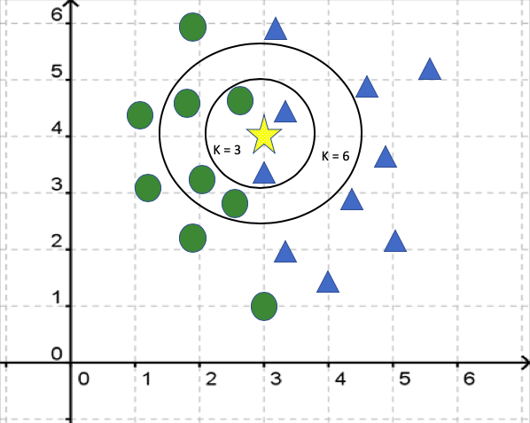

---
title: "K Nearest Neighbor Algorithm "
author: Margot Henry
output: pdf_document
---  
```{r, echo=FALSE, message = FALSE}
library(dplyr)
library(class)
```

# Why I Chose KNN Algorithm  
Over the passed summer I worked as a junior epidemiologist for Manitoba Health, I was exposed to data analysis surrounding all the communicable diseases in Manitoba and how they were spread and managed. This gave me a strong interest in predictive analysis and how we can use statistics to predict diseases before they have been medically classified. My idea was to try and understand how clustering could be used to identify two groups of patients based on their pre diagnostic conditions. The two groups being, one with positive results and one with negative results.    

# Background    
I started my project focusing on how k-means clustering could be used for predictive analysis of biological data. Researching gave me a better understanding of k-means clustering and led me to find supervised learning using the kNN algorithm. Using the kNN or K-Nearest Neighbor algorithm I was able to perform predictive analysis on my data set with good results.    

Researching k-means clustering for predictive analysis gave poor results. The limitations for k-means clustering are quite extensive and cause problems when predicting outcomes. When exploring k-means to predict data outcomes we found it struggled to identify two clusters in our data. The main cause of the poor results was the difference in how the two algorithms perform, k-means does not use a training dataset which gives kNN the advantage. When working with k-means clustering the user needs to know or predict how many clusters the data has. This can be difficult when working with some biological data as this allows for a small margin of error when estimating clusters. The diabetes data I was working with would only have 2 clusters, so this was not a huge issue in my case. But when I applied the k-means algorithm and compared my results with the pre-determined results I was left with a significant number of False Negatives and False Positives.  

Before understanding how the kNN algorithm worked and why it is better suited for predictive analysis compared to k-means we first needed to understand the difference between unsupervised and supervised learning.  
Unsupervised learning (k-means in our case) is a method used in machine learning to find unknown information for given data. The unsupervised algorithm does not need to be *supervised* or taught how to classify data, it decides using similar data points and a user defined threshold or cluster amount. Where supervised learning algorithms (kNN) are given a manually, pre-classified training data set which is used to teach the algorithm how to predict classifications. The supervised algorithm will learn what each outcome “looks like” based on the training data set provided, it the takes what it learns and applies it to the new un-classified data to try and predict what class each data point falls into.  

So, for me to perform predictive analysis I needed a data set which had pre-determined outcomes that could be used to train the kNN algorithm. When I started with this project, I was going to use the Manitoba hepatitis surveillance database. Unfortunately, I could not use this date due to privacy concerns. This led to me explore other possibilities. The data set I chose contained the diagnostic measurements along with the diabetic outcomes for the Pima Tribe population. The data set held 8 variables which are considered important when predicting diabetes as well as whether the patient does in fact have diabetes. Once I was confident with my data set and that kNN would be a good choice for predictions; I began the analysis. 

# Explaining kNN    
## How the algorithm works    
The easiest way to explain how kNN works is to break it down step by step. To start we have two data sets. The testing data set containing the data which needs to be classified, in our case this is the diabetes data set without the outcome column. The second data set needed is the training data set. The training data set is a subset of the full data set where the outcome has been manual determined.    

 


Lets look at an example. In *figure 1* the star will be a test data point within the test data set. It needs to be classififed as either a triangle or a circle. In other words, the kNN algorithm will calculate the Euclidean distance between the star and every other training point (circles and triangles). When K = 3, the kNN algorithm will group together the 3 nearest neighbors (data points), and classify the star as the most common classification within the group, in this case, the star will be classified as a triangle. When K = 6, the star will be classified as a triangle. The outomce will change depending on the K that you choose.  

The algorithm then takes each entry in the testing data set and iterates over the training data set to find the Euclidean distance between the test point and every training point. Once this is completed the algorithm finds the k nearest neighbors between the test point and the training points. Then, the algorithm finds the most common class from the k nearest neighbors training points and assigns the test point to that class.  

The Euclidean distance between two points A and B in a p-dimensional space:  
 $d(A,B) = \sqrt(a1 - b1)^2 + ... + (ap - bp)^2$     
In this case A would be the test data point and B would be the training data point with a classified outcome.  

  


## Choosing k-value    
When selecting a k value there are a few things that must be considered. The first thing that needs to be considered is the integrity of the data itself. When dealing with very large data (many records) it is recommended to split the data into multiple subsets. Another important data integrity aspect to consider is the data’s dimensions. kNN does not work well with data sets that are wider than they are long. The next aspect that needs to be considered is whether the data set being passed to the algorithm already has it’s outcome. If this is the case, then the best method for selecting k is to run a loop to iterate over a range of k values while also testing the accuracy of these k values, once completed you’re left with a list of k-values as well as their accuracy. Simply select the k value which performed the best.  

When the outcome is unknown (most cases) then the k value must be approximated. The standard way to find this value is to take the square root of the number of records being analysed. It is recommended to test k values around the square root value calculated. i.e. If a data set contains 1006 records, the recommended k value is 31.7. Therefore, it is recommended to test k value 31, 32 as well as 30 and 33 to see if any are noticeably different than the others.  

## Limitations  
When using the kNN algorithm there are a few limitations to consider. The first limitation that users need to consider is the design and creation of a reliable training data set. A training data set is a subset of the main data set that has been pre-categorized into the correct clusters. For example, our diabetes data set already had the outcome of each patient (Diabetic or Non-Diabetic). We took a 10% subset of this data set and called it the training data set. This data set is passed to the kNN algorithm which learned how each of the variables impact the outcome label. This becomes a limitation when we consider how much time it takes to create this subset. Since it is recommended to have a subset containing a minimum of 10% of the records in the main data set the user must spend an exponential amount of time manually creating and classifying the records in this data set. Consider a similar diabetes data set containing the population of Canada; the data set would be approximately 38 million records long, therefore the training data set would be a *minimum* of 3.8 million records. Classifying 3.8 million records would take a significant amount of time and may not be possible for most. Most data sets will not be this large but this limitation needs to be strongly considered before using the algorithm.  

Another limitation that needs to be considered before using the kNN algorithm is how the data is presented and prepared. Data preparation is considered a limitation to the kNN algorithm as it needs to follow a few important rules. The data set cannot have missing data. If the data is missing values, these values need to be replaced with something so they can still be classified, or they need to be removed. In our case, missing values were replaced with 0’s. The algorithm is sensitive to irrelevant attributes. Before the algorithm can properly run any and all irrelevant attributes need to be removed. An irrelevant attribute is anything that the user does not want to include in the calculation.  

For example, if our data set included names, we would remove them as the name of someone has nothing to do with if they have diabetes or not. The final data prep that must be considered before using the algorithm is normalization. The algorithm does not perform well with non-normalized or unscaled data. Before using the algorithm, all data needs to be normalized to the same scale. The equation we use for normalization can be found below, see *figure 3*.    

  


## Alternatives  
When exploring machine learning and supervised learning algorithms a few alternative options were found. The first alternative option and most relevant was SVM, Support Vector Machine Learning. SVM is another liner regression algorithm, though instead of using Euclidean distance, SVM uses hyper planes in the feature space. Like kNN, SVM is often used in prediction, though kNN is simpler and easier to implement in R which is why it was the better choice for this project. 

The next alternative method was LDA, Latent Dirichlet Allocation. LDA is a generative probabilistic model for collections of discrete data. LDA would be the superior option if our data was in a textual form. For example, if instead of having columns for BMI, Glucose and Blood pressure we had a sentence that described a person, their attributes and their result. In this case LDA would analyze the document to find a mixture of topics (outcomes) which are defined by the words (attributes) and similar documents (people). Since our data is in matrix, numerical form kNN was the better pick.  

Other advanced machine learning methods should also be considered when exploring predictive analysis such as Neural Networks, Hierarchical clustering or Naïve Bayes. Many of the more advanced AI and machine learning methods require much higher computing power and a deeper understanding in computer science and computer architecture. For this reason, I chose to focus on kNN as it still provides promising results with very little computing power required.  

## Assumptions  
Now that we have discussed the limitations, lets note some of the assumptions in kNN. The first, most notable assumption is that the data being used in the algorithm must be in a metric space. A metric space is defined as a set with a metric on the set where the metric is a distance function between any two points in the set. The next assumption is the existence of the training data set along with it’s respective class labels. The data must have a minimum of two class labels but works just as well with an increased number of class labels. With an increasing number of class labels the algorithm will perform better with a greater amount of data. As discussed in limitations, the algorithm assumes the data being passed to it is in a normal, or scaled form. This can simply be done by the user running a basic function over the data before using it in the algorithm but is necessary for accurate results. The final assumption we need to make is the estimated value of k. The kNN algorithm requires a value k, which is used to count nearest neighbors. The algorithm does not calculate the k value so it is left to the user to try and calculate k so that they can get the most accurate results.  

## Best applications for this method (kNN)     
kNN is most often used in Classification and Regression problems. Since kNN is easy to implement; it is often the go-to choice for those who need quick results but may not have the computational background that other machine learning algorithms require. kNN has been used in the Medical, Agriculture, Military and Law fields. Some examples of these applications are as follows. Agriculture uses kNN to predict and simulate weather forecasts and soil water parameters using more complex data like satellite imaging. kNN has applications in Finance as well; including stock market forecasting which can range from investment strategies to market trends. kNN has big impact on credit card companies as they use the algorithm to identify potential credit card holders and if they are prone to bankruptcy or bad credit. These companies also use the algorithm for monitoring loans, exchange rates, and credit ratings. The police have also made good use of the algorithm working with financial experts to detect money laundering habits. kNN can be used in most prediction needs when human attributes and habits are involved. The military could use the kNN algorithm to classify potential threats based on internet search trends, human habits such as geographical history, or the social network they keep. Then applying this to a larger database of humans and trying to find potential threats they may need to explore further. The final, and my favourite application for kNN is in the medical field. kNN has not only been used to predict and classify clients before a medical exam. It is also used to identify risk factors in diseases which lack meaningful research like prostate cancer. Another use of kNN in the medical field is to predict whether a heart attack patient will have a reoccurring heart attack based off their medical variables, demographics and diet.  

# Results  
Since my data set came with the predetermined outcomes, I could calculate the accuracy of my results easily. This also allowed me to find the best fit k value for our data by testing the accuracy for each k value between 1 and 75. Though, it should be noted that this is not realistic in an industry setting since the only known outcomes would be those that have been determined for the training data set. When running the algorithm a few interesting results have been noticed. The first thing to note is the lack of data used for our test. Since we only have 800 records; our training data set should only be around 80 records. This makes getting very accurate results difficult as the algorithm does not have a lot of records to use for training. Despite using a smaller than recommended data set, our results are still surprisingly impressive.  

    

For the results themselves. After running the algorithm over the test data set, we compared the results with the original outcomes. I found with the best k value and using a 10% subset for training data that my results were as follows.  

A total accuracy of **77.5%** this was calculated with the following values:  
*True-Positive:* **134**  
*True-Negative:* **402**    
*False-Positive:* **54**  
*False-Negative:* **102**        

Using these values, we find we have a sensitivity of **56.8%** and a specificity of **88.2%**. These results indicate that using this algorithm on a smaller data set would provide results that are not ideal but can be used. The results would miss diagnose patients who have diabetes as not having diabetes, obviously this is not the ideal case. The low sensitivity can be explained by the lack of positive outcomes in our data set. As explained earlier the data set used for this analysis was smaller than recommended, this combined with the fact that there are more negative outcomes than positive outcomes resulted in our sensitivity being natrually lower. In theory, using a much larger data set we would see significantly better results. If I were to do this analysis again; I would try to find a larger data set to see how the results changed using a larger training data set.  

# Implementing kNN in R     

## The function to use
knn(train, test, cl, k = 1, l = 0, prob = FALSE, use.all = TRUE)

**train:** matrix or data frame of training set cases.

**test:** matrix or data frame of test set cases. A vector will be interpreted as a row vector for a single case.

**cl:** factor of true classifications of training set

**k:** number of neighbours considered.

**l:** minimum vote for definite decision, otherwise doubt. (More precisely, less than k-l dissenting votes are allowed, even if k is increased by ties.)

**prob:** If this is true, the proportion of the votes for the winning class are returned as attribute prob.

**use.all:** controls handling of ties. If true, all distances equal to the kth largest are included. If false, a random selection of distances equal to the kth is chosen to use exactly k neighbours.
 
[RStudio Documentation Link](https://www.rdocumentation.org/packages/class/versions/7.3-15/topics/knn)

## The Algorithm  

```{r, message=FALSE}
# Load libraries
library(class)
library(dplyr)

# Set seed to a totally random number
set.seed(686)

# Read the diabetes dataset
diabetes = read.csv("data/diabetes.csv")

# Creating a subset of the original dataset to be normalized
diabetes.subset = diabetes[
  c( 1, 2, 3, 4, 5, 6, 7, 8, 9 )
]

# The normalize function, used to normalize our data so it can be on the same 
# scale for our knn algorithm
normalize = function( x )
{
  ( x - min( x ) ) / ( max( x ) - min( x ) )   
}

# Using the lapply() function to normzalize the data
diabetes.subset.n = as.data.frame(
  lapply(
    diabetes.subset, 
    normalize  
  )
)

# Using sample, we select a random n % of the records in our main dataset to be 
# used for our training dataset

# For our case we are sampling 10% of the data
random = sample(
  1:nrow(diabetes.subset.n),
  size = nrow(diabetes.subset.n) * 0.10,
  replace = FALSE
) 

# Using the random 10% of records selected about we create our training dataset
# For now, we remove the Outcome column, this will be added again later with the
# labels.
diabetes_train = diabetes.subset.n[random, -9] 

# Using all the records that are not included in the training dataset we create 
# our test dataset. This is the dataset we are applying kNN to in an attempt to
# predict Outcome.
diabetes_test = diabetes.subset.n[-random, -9]

# The training labels are the pre-determined outcomes that the algorithm will 
# use to assign classes
diabetes_train_labels = diabetes[random, 9]

# The test labels are the pre-determined outcomes that we wil use to compare the
# accuracy of our final results after applying the kNN algorithm.
diabetes_test_labels = diabetes[-random, 9]  

# This is a empty list that will hold the accuracy test values for our k-value 
# test
k_accuracy_list = setNames(
  data.frame(
    matrix(
      ncol = 2, 
      nrow = 0
    )
  ), 
  c(
    "k", 
    "accuracy"
  )
)

# We use a for loop to test k values 1-100. We can only do this since we have
# outcome already available. If outcome was not available we would need to
# estimate k. Generally this is done using: k = sqrt( nrow( diabetes_test ) )
for(i in c(1:75)){
  knn.i = knn(
    train=diabetes_train, 
    test=diabetes_test, 
    cl=diabetes_train_labels, 
    k=i
  )
  
  ACC.i=100 * sum(
    diabetes_test_labels == knn.i
  ) / NROW( diabetes_test_labels ) 
  
  k_accuracy_list[i,]$k = i
  k_accuracy_list[i,]$accuracy = ACC.i
}

# Finally, after we found the most accurate k, in this case k = 7, to be used again for comparing
best.k = k_accuracy_list$k[
  which(
    k_accuracy_list$accuracy == max(k_accuracy_list$accuracy)
  )
]

# We now pass the best k value back into the algorithm so we can see the results
knn.best = knn(
  train=diabetes_train, 
  test=diabetes_test, 
  cl=diabetes_train_labels, 
  k=best.k
)

# We have already done this, but again we calculate the accuracy
ACC.best = 100 * sum(
  diabetes_test_labels == knn.best
) / NROW( diabetes_test_labels ) 

# Finally, we compare the outcome with the knn results so we can see sensitivity
# and specificity
table(
  knn.best,
  diabetes_test_labels
)
```  


